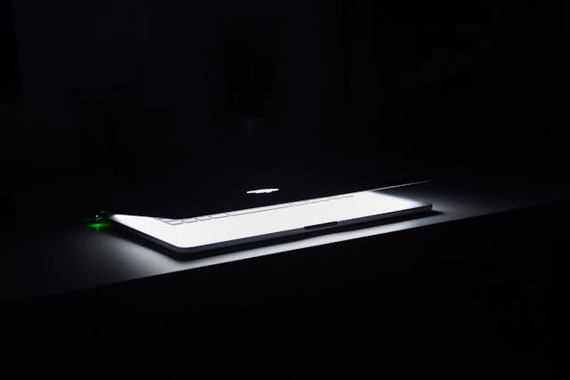

# My First Slide

Hello World!



---
# Use Cases for Marp
- Repeatable way to build slides
- Integrate slide with some repository
- Sharing ``code examples`` with presentation

---
# How to change Theme

Nice and dark 🌔

```markdown
---
marp: true
author: Joan G.
theme: default
class: invert
```

---

# To get Free Pictures


Use:
- [Pexels](https://www.pexels.com)
- [Unsplash](https://unsplash.com)

How to work with images:
- [image syntax](https://marpit.marp.app/image-syntax)

Say thanks! - add a reference to the author or collection.

---


